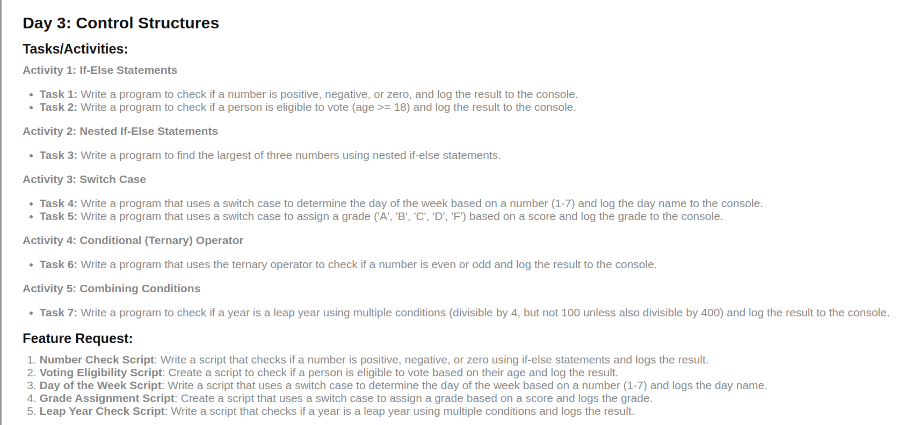
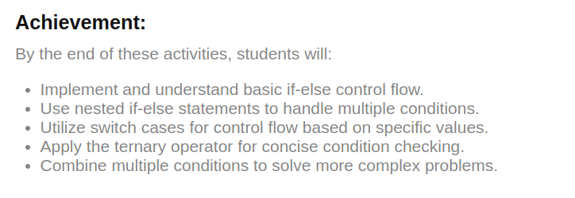

# Day 3 : Control Structures





## My Learning : 

1. Nested if-else, don't use else-if.
2. Switch case uses strict comparisons, you can NOT use directly support range comparisons. Hence, trick is to use `true` in swtich expression
```js
let x = 20;
let value;

switch (true){
    case x>10 :
        value='Less';
        break;
    case x>100 :
        value='More';
        break;
    default:
        value='zero';
}
```
3. Use and operator `&&` and `||` or operator together instead of if-else-if :)

**I don't understand feature requests! -_-**

---