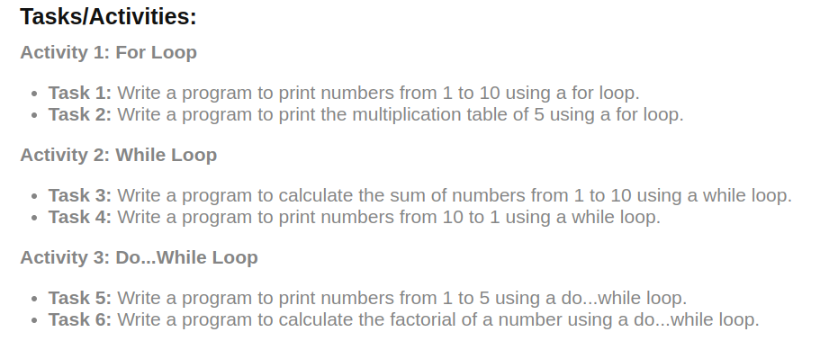

# Day 4 : Loops

## Learnings :

1. How to use different loops.
2. In loop outer loop runs for the no. of rows u want the pattern to print where as inner loop is for the col.
3. `continue` and `break` are used to control the flow of for/ while loops.

---
