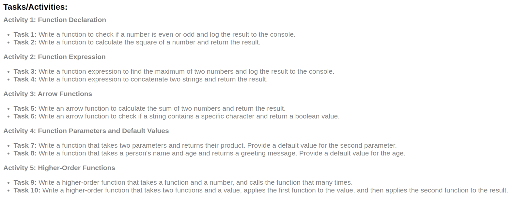
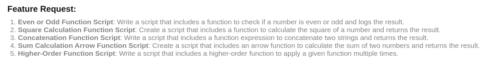
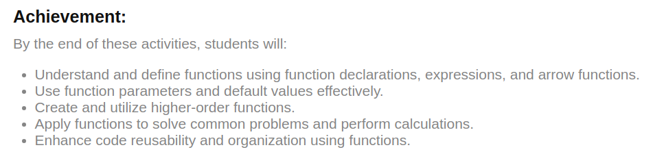

# Day 5 : Functions

## Learnings

1. `return` is optional in a `function`.
2. Normal function declarations are *hoisted*, while function expressions are not.
3. Arrow functions are best suited for non-method functions (functions not attached to objects) and should not be used as constructors.
4. Arrow functions have their own limitations, such as not having access to the arguments object.
5. A higher-order function (HOF) is a concept in programming where a function accepts another function as an argument and returns a function as its result. In other words, it treats other functions as first-class citizens, allowing them to be used just like other data types (such as strings or numbers) in your code

---
